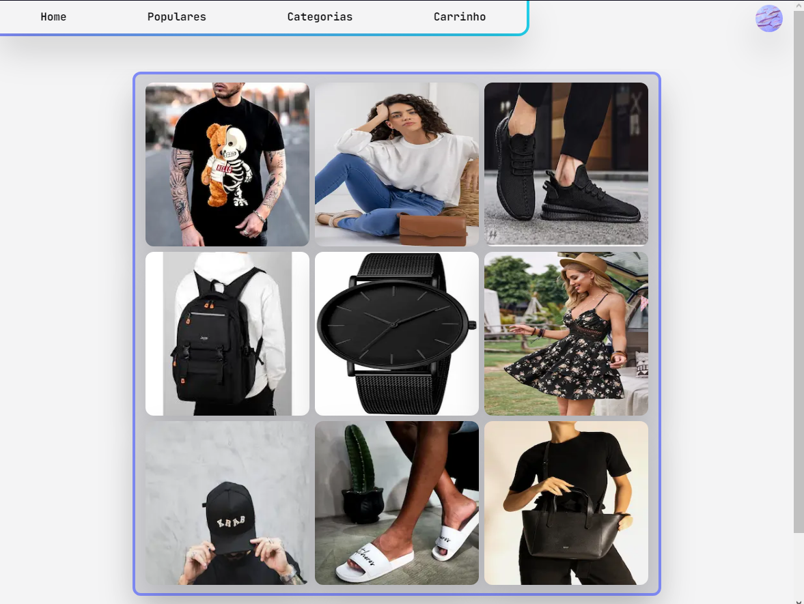

# Takoyaki - Projeto de E-commerce



Takoyaki é um projeto de e-commerce construído com Next.js, Tailwind CSS e a biblioteca de gerenciamento de cache React Query. Este projeto oferece uma plataforma moderna e eficiente para compra e venda de produtos online, combinando a velocidade do Next.js com a facilidade de uso e a estilização rápida do Tailwind CSS.

## Recursos Principais

- **Rápido e Eficiente:** Desenvolvido com Next.js para garantir uma experiência de usuário rápida e responsiva.
- **Estilização Simples:** Utiliza Tailwind CSS para uma estilização rápida e personalizável.
- **Gerenciamento de Estado:** Incorpora React Query para gerenciar o cache de dados de forma eficiente.
- **Integração com API:** Conecta-se facilmente a APIs para obter e atualizar dados de produtos.

## Instalação

1. Clone o repositório do Takoyaki em sua máquina local:

```bash
git clone https://github.com/N7thz/takoiaki.git
```